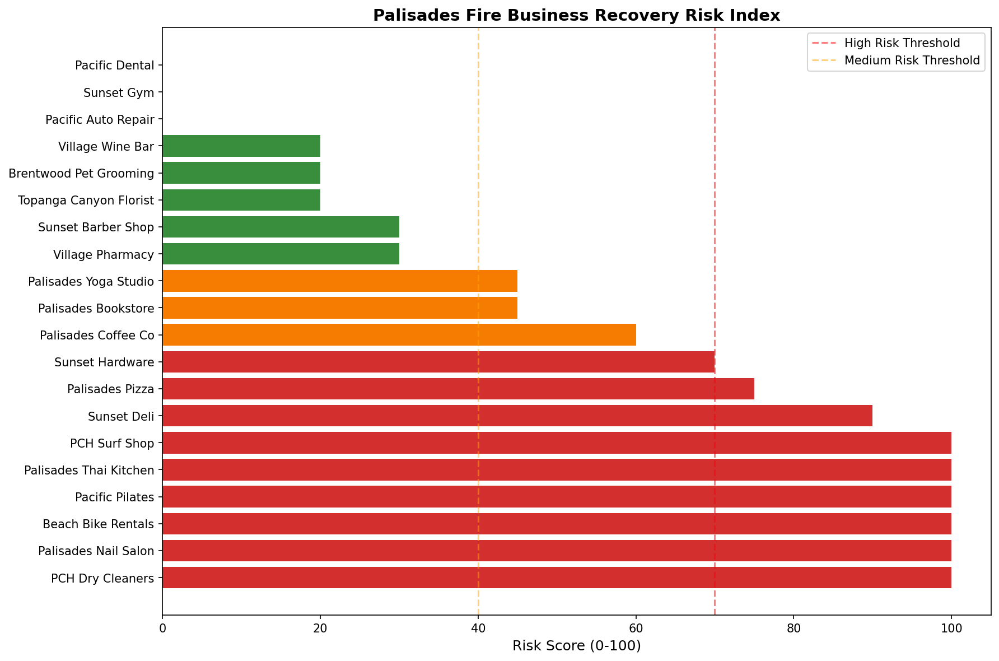

# palisades-recovery-analysis

# Palisades Fire Business Recovery Risk Index

## The Problem

In January 2025, the Palisades Fire destroyed over 6,000 structures in my 
neighborhood. I watched small businesses I grew up around go dark overnight:
the coffee shop, the hardware store, the dry cleaner. Some of them got 
SBA loans and came back. A lot of them never did.

What I noticed is that there was no way for anyone to know in advance which 
businesses were going to make it and which weren't. Recovery money went to 
whoever applied first. Not whoever needed it most. By the time it was clear 
a business was failing, it was already too late to help.

That's the gap this project tries to fill.

## What This Project Does

This analysis pulls public datasets to build a Business Recovery Risk Index.
Every affected small business in the Palisades fire zone gets a score from 
0 to 100 based on how likely they are to permanently close within 12 months.

The goal is a simple prioritization tool for SBA case managers and city 
recovery coordinators. Someone with 200 businesses on their list and a few 
hours to decide who gets a call today.

## Data Sources

| Dataset | Source | What It Tells Us |
|---|---|---|
| SBA Disaster Loan Applications | SBA FOIA Data | Approval rates and loan amounts by ZIP code |
| FEMA Public Assistance Records | OpenFEMA | Which areas got federal aid and how much |
| CA Business Registry | CA Secretary of State | Which businesses dissolved after the fire |
| CAL FIRE Perimeter Shapefile | FRAP GIS Data | Exact burn zone boundaries |
| Yelp Business Data | Yelp Fusion API | Permanent closures tracked in real time |
| Zillow Property Data | Zillow Research | Property value recovery by neighborhood |

## How the Risk Score Works

Each business gets points across five factors:

| Factor | Weight |
|---|---|
| Located in the primary burn zone | 30 pts |
| SBA loan denied or never applied | 25 pts |
| High-closure industry type | 20 pts |
| No Yelp activity after the fire | 15 pts |
| Business was under 3 years old pre-fire | 10 pts |

Total score out of 100. Higher score means higher closure risk.

## What Success Looks Like

Three things would tell me this works:

1. The model correctly flags 70%+ of businesses that end up permanently 
   closing within 12 months, checked against CA Secretary of State 
   dissolution records
2. Case managers using the tool reach the highest-risk businesses before 
   they close, not after
3. 12-month survival rates improve by at least 15% in areas using the 
   tool compared to areas that didn't

## Why This Is Not Just a Palisades Project

After any federal disaster declaration in the US, the same data shows up: 
FEMA records, SBA applications, state business filings, fire or flood 
perimeter maps. Palisades is where I'm starting because I know it and 
because the data is fresh. But the same framework should work for the 
next disaster too, whether that's another wildfire, a hurricane, or a flood.

The idea is that a recovery coordinator anywhere in the country could run 
this within 30 days of a disaster being declared.

## Risk Score Output

The chart below shows all 20 businesses in the Palisades fire zone ranked 
by their recovery risk score. Red bars indicate high risk of permanent 
closure, orange is medium risk, and green is low risk.

## Output Data

The full ranked dataset with risk scores and risk tiers for all 20 businesses 
is saved in `palisades_risk_scores.csv` in this repository.
